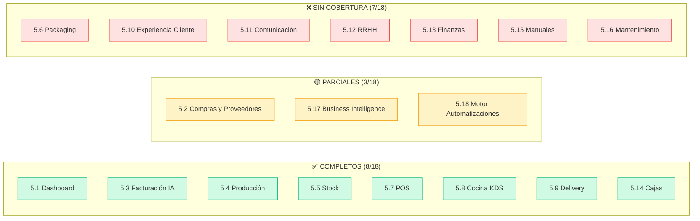

# 📊 Análisis de Cobertura UX: Anexo Funcional vs. Prototipos Construidos

> **Fecha:** 04/08/2026
> **Fuente:** Cruce directo del [Anexo Funcional contractual](file:///C:/Users/nahue/.gemini/antigravity/brain/6b80ff63-c4f2-470b-a96e-3ceabad9effc/anexo_funcional_contrato.md) (18 módulos definidos en Sección 5) contra los [12 prototipos HTML funcionales](file:///D:/Musica%20Descargada/Burger_Music_OS/HTML_Prototipos) construidos hasta hoy.

---

## Resumen Ejecutivo

| Métrica | Valor |
|---------|-------|
| Módulos definidos en contrato | **18** |
| Módulos con prototipo UX completo | **8** (44%) |
| Módulos parcialmente cubiertos | **3** (17%) |
| Módulos sin cobertura UX | **7** (39%) |
| Prototipos HTML funcionales | **12** |

---

## Mapa Completo: Los 18 Módulos

### ✅ COMPLETOS — Prototipo funcional construido

| # | Módulo Contractual | Prototipo(s) | Funcionalidades UX Cubiertas |
|---|---|---|---|
| 5.1 | **Dashboard Ejecutivo** | `dashboard_prototipo.html` | Ventas/Egresos/Margen, Alertas Inteligentes (Alta/Media), Yield Card, Slide-over Lotes Desviados. F-Pattern optimizado. |
| 5.5 | **Control de Stock** | `conteo_stock_prototipo.html` | Conteo rápido normalizado, Mermas (Container Transform), Alertas de mínimo, Botón "Agotado [0]", Ítems Fantasmas (Bottom Sheet), Gamificación, Ticket Digital de Cierre. |
| 5.7 | **Punto de Venta (POS)** | `pos_prototipo.html` | Catálogo real (11 categorías), Modificadores estrictos (sin texto libre), Consumo de personal bonificado, Split Pay, Descuento BOM automático. |
| 5.8 | **Cocina (KDS)** | `kds_prototipo.html` | Vista Kanban, Routing por estación (Parrilla/Mostrador), Checklist Atómico, Recall 10s. |
| 5.4 | **Producción** | `produccion_prototipo.html` | Mobile-first, Separación semántica de mermas (Descarte/Reaprovechamiento), Smart Defaults de rinde, Lote Rápido, Yield por lote. |
| 5.14 | **Gestión de Cajas** | `cajas_prototipo.html` | Fichaje obligatorio (PIN/QR), Apertura/cierre con fondo, Cuenta corriente interna. |
| 5.9 | **Delivery Inteligente** | `delivery_prototipo.html` | Integración API (PedidosYa/Rappi/ML), Asignación de flota (propio vs tercerizado), Tracking de estados. |
| 5.3 | **Facturación Inteligente** | `compras_inbox_prototipo.html` + `compras_layout_prototipo.html` + `compras_validacion_prototipo.html` + `compras_nueva_factura_prototipo.html` + `compras_carga_manual_prototipo.html` | Inbox de estados, Validación IA lado a lado, Wizard 3 pasos, Familias de Medida, Flashcards, Equivalencias, Dedo Pesado, Bloqueo Matemático. |

---

### 🟡 PARCIALES — Cubiertos de forma indirecta o incompleta

| # | Módulo Contractual | Estado Actual | ¿Qué falta? |
|---|---|---|---|
| 5.2 | **Compras y Proveedores** | La carga de facturas y validación IA están completas. | Falta: **ABM de Proveedores** (alta/baja/modificación), **Comparación de precios** entre proveedores, **Historial de compras** por proveedor, **Órdenes de Compra sugeridas** (IA + BOM + Stock Mínimo). |
| 5.17 | **Business Intelligence** | El Dashboard tiene indicadores básicos (Ventas, Margen, Yield). | Falta: **Reportes ejecutivos** descargables, **Análisis de rentabilidad por producto**, **Evolución de ventas** (gráficos de tendencia), **Comportamiento de clientes** (frecuencia, ticket medio por cliente). |
| 5.18 | **Motor de Automatizaciones** | Las alertas inteligentes del Dashboard y el "Dedo Pesado" son automatizaciones básicas. | Falta: **Sistema de reglas configurable** por el usuario, **Sugerencias automáticas de compra**, **Detección de desvíos** (margen que cae, proveedor que sube precios), **Motor de notificaciones** (push/email/WhatsApp). |

---

### ❌ SIN COBERTURA — Módulos sin prototipo UX

| # | Módulo Contractual | Descripción del Contrato | Complejidad Estimada | Dependencias |
|---|---|---|---|---|
| 5.6 | **Packaging** | Stock de packaging, consumo por producto, alertas de reposición. | 🟡 Media | Depende de que Stock (5.5) esté en producción. Puede ser una extensión del conteo con categoría "Packaging". |
| 5.10 | **Experiencia del Cliente** | App móvil, web, seguimiento de pedidos, historial, promos, fidelización, CRM, encuestas. | 🔴 Alta | Es un ecosistema completo orientado al cliente final. Requiere definición estratégica con Gerencia. |
| 5.11 | **Comunicación** | WhatsApp Business, notificaciones automáticas, campañas, promos. | 🟡 Media | Depende de la API de WhatsApp Business y del CRM (5.10). |
| 5.12 | **Recursos Humanos** | Legajos, asistencia, control horario, liquidación de horas, recibos, adelantos, bonificaciones. | 🔴 Alta | Módulo independiente. Requiere definir si el fichaje de Cajas (5.14) se extiende a RRHH o son sistemas separados. |
| 5.13 | **Finanzas** | Flujo de fondos/caja, cuentas por cobrar/pagar, conciliaciones, proyecciones, stock de dinero por sucursal. | 🔴 Alta | Depende de que Compras y POS estén en producción para alimentar el flujo real. Es el "cerebro financiero" del sistema. |
| 5.15 | **Manuales y Procesos** | Repositorio de SOPs, recetas, capacitaciones, videos instructivos. | 🟢 Baja | Módulo documental, relativamente simple. Puede ser un wiki interno con markdown. |
| 5.16 | **Mantenimiento** | Mantenimiento preventivo/correctivo de equipos, alertas, historial de intervenciones. | 🟢 Baja | Módulo independiente. Puede ser un CRUD con calendario de mantenimiento. |

---

## Análisis Visual de Cobertura

---

## Recomendación de Priorización (Próximos Prototipos)

Basado en el impacto operativo y las dependencias entre módulos:

### Ola 1 — Completar los Parciales (cerrar brechas de lo que ya existe)

| Prioridad | Módulo | Qué prototipar | Por qué ahora |
|-----------|--------|-----------------|----------------|
| 🔴 | **5.2 Compras** — Gestión de Proveedores | Pantalla de edición, historial de compras y comparativa de precios. (La creación (Alta) ya está resuelta on-the-fly en la carga manual/IA). | Sin esto, no hay contexto histórico para tomar decisiones de a quién comprarle. |
| 🔴 | **5.2 Compras** — OC Sugeridas | Pantalla donde el sistema sugiere qué comprar basándose en BOM + Stock actual + Consumo promedio. | Cierra el círculo de automatización del abastecimiento. |
| 🟡 | **PDFs Multi-Página (Tijera)** | Interacción para splitear PDFs largos de proveedores. | Caso de uso real ya identificado que bloquea operación. |

### Ola 2 — El Cerebro Financiero

| Prioridad | Módulo | Qué prototipar | Por qué |
|-----------|--------|-----------------|---------|
| 🔴 | **5.13 Finanzas** | Flujo de caja, cuentas por pagar/cobrar, conciliaciones, 3-Way Match visual. | Es el módulo que le da sentido estratégico a todo lo demás. Sin finanzas, Gerencia no puede tomar decisiones. |
| 🟡 | **5.17 BI** — Reportes | Reportes descargables, gráficos de tendencia de ventas, rentabilidad por producto. | Extensión natural del Dashboard. |

### Ola 3 — Ecosistema Extendido

| Prioridad | Módulo | Qué prototipar | Por qué |
|-----------|--------|-----------------|---------|
| 🟡 | **5.12 RRHH** | Legajos, control horario, liquidación básica. | Necesita definición de Gerencia sobre el alcance real. |
| 🟡 | **5.6 Packaging** | Extensión del módulo de Stock con categoría "Packaging". | Relativamente simple, se puede clonar la lógica de conteo. |
| ⚪ | **5.10 Exp. Cliente** | App/web del cliente, fidelización, CRM. | Ecosistema completo que requiere planificación estratégica aparte. |
| ⚪ | **5.11 Comunicación** | Integración WhatsApp Business. | Depende de API y del CRM. |
| ⚪ | **5.15 Manuales** | Wiki interno / repositorio de SOPs. | Baja complejidad, se puede hacer en cualquier momento. |
| ⚪ | **5.16 Mantenimiento** | CRUD de equipos + calendario preventivo. | Baja complejidad, módulo independiente. |
| ⚪ | **5.18 Automatizaciones** | Motor de reglas configurable. | Se va construyendo orgánicamente a medida que cada módulo madura. |

---

> [!IMPORTANT]
> **Conclusión:** El **core operativo** (la cadena Compras → Stock → Producción → POS → Cocina → Delivery) está **100% prototipado**. Lo que falta son los módulos de **gestión estratégica** (Finanzas, BI, RRHH) y el **ecosistema extendido** (Cliente, Comunicación, Mantenimiento). La recomendación es cerrar primero las brechas de Compras (ABM Proveedores + OC Sugeridas) y luego atacar Finanzas, que es el módulo que le da sentido de negocio a todo lo construido.
