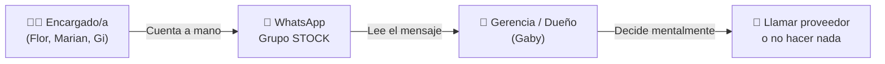

# 🔍 Análisis Operativo: Stock y Producción Actual vs. Music OS

> Basado en los mensajes reales de WhatsApp del grupo "📌 STOCK" de Burger Music y el catálogo de Pedix.

---

## 1. Cómo funciona HOY (Pain Points)

### El flujo actual de stock es 100% manual vía WhatsApp:



**Problemas detectados:**

| Problema | Ejemplo real | Impacto |
|----------|-------------|---------|
| **Sin historial analizable** | Los mensajes se pierden en el chat | No se pueden generar tendencias de consumo |
| **Sin alertas automáticas** | "SALCHICHAS UNION GRANADERA: No hay" aparece repetido en 4 reportes consecutivos | Nadie toma acción hasta que el dueño lo ve |
| **Inconsistencia de formato** | "JAMON: 5 de 10 unid /3.200 kg" vs "JAMON: 9 de 10 unid /3.200 kg" | La unidad de medida cambia (paquetes vs kg) |
| **Sin cálculo de consumo** | Medallones: 180 (Jue 23) → 130 (Vie 24 mediodía) → 190 (Vie 24 noche ¿repusieron?) → 83 (Sáb 25) → 10 (Dom 26) | El consumo diario hay que calcularlo a mano |
| **Doble conteo ineficiente** | Hay un conteo de stock por turno (mediodía + noche) | El encargado pierde 15-20 min contando |

---

## 2. Items de Stock Reales de Burger Music

Del relevamiento de WhatsApp extraje **5 categorías con ~30 items** que se controlan diariamente:

### ✅ CARNES
| Item | Unidad | Stock mínimo estimado* |
|------|--------|----------------------|
| Medallones (de carne) | unidades | ~50 (para un turno) |
| Nirvana de Carne | unidades | ~2 |
| Nirvana de Pollo | unidades | ~2 |

### ✅ PANES
| Item | Unidad | Stock mínimo estimado* |
|------|--------|----------------------|
| Pan TBP (principal) | unidades | ~200 |
| Lunático | unidades | ~4 |
| Queso Gratinado | unidades | ~20 |
| Sandwich | unidades | ~5 |
| Pancho | unidades | ~5 |
| Pan Nirvana | unidades | ~5 |

### ✅ QUESOS Y FIAMBRES
| Item | Unidad actual | Problema de unidad |
|------|---------------|-------------------|
| Cheddar Fetas | barras | ✅ Claro |
| Cheddar Pouch | pouches | ✅ Claro |
| Jamón | "5 de 10 unid / 3.200 kg" | ⚠️ Mezcla paquete + peso |
| Queso Dambo | "6 de 10 unid / 1 horma" | ⚠️ Mezcla paquete + horma |
| Provoleta | "5 de 10 / 8 unid" | ⚠️ Confuso |
| Queso Parmesano | hormas | ✅ Claro |
| Panceta | unidades (paquetes) | ✅ Claro |

### ✅ CONGELADOS
| Item | Unidad | Observación |
|------|--------|-------------|
| Papas Simplot Crunch | bolsas | Principal |
| Papas Noisette | bolsas | Bajo movimiento |
| Papas Rústicas | bolsas | |
| Salchichas Unión Granadera | — | **"No hay" en todos los reportes** |
| Salchichas Alemanas | — | **"No hay" en todos los reportes** |
| Medallones Pollo Crunch Sadia | bolsas | |
| Medallones Pollo 3 Arroyos | bolsas | |
| Nuggets | bolsas | |
| Fingers | bolsas | |
| Ricosaurios | bolsas | |
| Bastones de Muzza | unidades | |
| Aros de Cebolla | unidades | |
| Medallón NotCo (veggie) | unidades | |
| Medallón Cebolla Caramelizada | unidades | |
| Franui | unidades | Postre congelado |

### Conteo final del turno (aparece al pie)
| Item | Unidad |
|------|--------|
| Medallones de Carne (total producido) | unidades |
| Pan PBT (total producido) | unidades |
| Papas (total) | bolsas |

---

## 3. Preguntas que ESTA DATA RESPONDE (del documento de Preguntas Clave)

| Pregunta | Respuesta derivada de la data real |
|----------|-----------------------------------|
| **#12: ¿Stock mínimo por producto o por categoría?** | **Por producto individual.** Cada item tiene un comportamiento de consumo diferente (ej. Medallones se consumen 50-100/turno, Pan Nirvana apenas 2-3). No tiene sentido un mínimo por categoría. |
| **#11: ¿Mermas en Producción o en Stock?** | **En Stock.** El conteo se hace al cierre de turno comparando inicio vs. fin. La diferencia = consumo + mermas. Debería estar en la misma pantalla de stock para no fragmentar el flujo. |
| **#14: ¿Se necesita conteo físico?** | **Sí, absolutamente.** Hoy hacen conteo físico 2 veces por día (mediodía y noche). Music OS debe tener un flujo de "Conteo Rápido" optimizado para que tome 5 minutos, no 20. |
| **#13: ¿Stock mínimo se configura por producto?** | **Sí.** Los datos muestran que "Salchichas" llevan semanas en "No hay" sin que nadie reaccione. Un stock mínimo por producto con alerta automática habría generado una notificación al Dashboard al primer "0". |

---

## 4. Consumo Diario Calculado (datos reales)

Con los 4 reportes de stock, puedo calcular el consumo real:

### Medallones de Carne (Item más crítico)
| Fecha | Turno | Stock | Δ Consumo |
|-------|-------|------:|----------:|
| Jue 23/7 | Noche | 180 | — |
| Vie 24/7 | Mediodía | 130 | -50 (noche jueves) |
| Vie 24/7 | Noche | 190 | +60 (reposición de producción) |
| Sáb 25/7 | Mediodía | 83 | -107 (viernes noche + sáb mediodía) |
| Dom 26/7 | Noche | 10 | -73 (sábado noche + dom) |

> [!WARNING]
> **Hallazgo crítico:** El domingo a la noche quedaron **solo 10 medallones**. Si el turno tiene un pico de 50 comandas, se quedan sin producto. Music OS debe generar una **alerta de prioridad alta** cuando los medallones bajan de ~50 unidades.

### Papas Simplot Crunch
| Fecha | Turno | Stock | Δ Consumo |
|-------|-------|------:|----------:|
| Jue 23/7 | Noche | 54 | — |
| Vie 24/7 | Mediodía | 124 | +70 (recibieron pedido) |
| Vie 24/7 | Noche | 78 | -46 |
| Dom 26/7 | Noche | 50 | -28 |

---

## 5. Cómo debe verse en Music OS (Recomendaciones de Diseño)

### Pantalla de "Conteo Rápido" (reemplaza el WhatsApp)
```
┌──────────────────────────────────────────────┐
│  📦 Conteo de Stock — Dom 26/7 — Noche      │
│  Encargada: Flor                              │
├──────────────────────────────────────────────┤
│                                               │
│  ✅ CARNES                                    │
│  ┌─────────────────────┬──────┬─────────┐    │
│  │ Medallones          │ [10] │ 🔴 BAJO │    │
│  │ Nirvana Carne       │ [ 1] │ 🟡      │    │
│  │ Nirvana Pollo       │ [ 0] │ 🔴 SIN  │    │
│  └─────────────────────┴──────┴─────────┘    │
│                                               │
│  ✅ PANES                                    │
│  ┌─────────────────────┬──────┬─────────┐    │
│  │ Pan TBP             │[372] │ 🟢      │    │
│  │ Lunático            │ [ 4] │ 🟡      │    │
│  │ Queso Gratinado     │ [42] │ 🟢      │    │
│  └─────────────────────┴──────┴─────────┘    │
│                                               │
│  [  Guardar Conteo  ]  ← botón inhabilitado  │
│  (se habilita cuando todos los campos         │
│   tienen valor)                               │
└──────────────────────────────────────────────┘
```

**Principios aplicados:**
1. **Prevención de errores:** El botón "Guardar" se habilita solo cuando todos los campos tienen valor (evita enviar conteo incompleto).
2. **Código de color instantáneo:** 🟢 OK / 🟡 Bajo / 🔴 Crítico o sin stock. El encargado ve de un vistazo qué está mal.
3. **Input numérico puro:** Solo campos de número. Nada de texto libre como "5 de 10 unid / 3.200 kg".
4. **Unidades normalizadas:** El sistema define la unidad (ej. "bolsas" para papas), el usuario solo escribe el número.

### Conexión con el Dashboard
Cada vez que se guarda un conteo con items en 🔴, el Dashboard genera automáticamente una alerta:
- *"Stock por debajo del mínimo: Medallones (10 unid). Consumo estimado del turno: 50-70. **Riesgo de quiebre**."*

---

## 6. Lista de Materiales (BOM) y Recetas

Al no encontrar el archivo de Gary, busqué y analicé el archivo `Productos_BOM_completado_con_detalle.xlsx`. Este archivo contiene la configuración exacta de **cómo se arman los productos**, un elemento crítico para automatizar el descuento de stock (Módulo 5.5).

### Ejemplos extraídos del BOM:
- **Clasic Simple 110g**: Se vincula con los ingredientes base (Medallón, Cheddar, Pan).
- **Mala Fama Simple 110g**: Lleva Cheddar, Panceta, Huevo, Cebolla Caramelizada, Salsa Barbacoa y Papas.
- **Red Hot Simple 110g**: Cheddar, lechuga, tomate, jamón, salsa especial y Papas.
- **Papas Queen**: Requiere "200 x Papas Fritas Congeladas | 15 x Salsa Extra Crunch". 
- **Nuggets x12 + Papas + BBQ**: Descuenta la porción de nuggets y las papas correspondientes.

### Impacto en Music OS (Módulo 5.4 Producción y 5.5 Stock):
1. **Descuento Automático en Cascada:** Cuando el POS (Módulo 5.7) cobra un *Clasic Triple 330g*, el sistema no descuenta "1 Clasic Triple", sino que descuenta automáticamente **3 medallones, 1 pan y 3 porciones de cheddar** del inventario base.
2. **Alertas Predictivas:** Si el sistema sabe que un *Duko Simple* requiere Panceta, y el stock de Panceta está en "🔴 BAJO" (según el Conteo Rápido), el POS puede alertar al cajero que quedan pocas unidades de ese producto específico.

---

> [!TIP]
> **Conclusión del Análisis de Datos Reales:**
> Hemos cruzado las ventas de Pedix, el stock por WhatsApp y la estructura de recetas (BOM). Music OS tiene ahora una base de datos real y funcional para prototipar.
> **Próximo paso:** Continuaré con las tareas del plan actualizando los prototipos con estos datos exactos y maquetando los módulos pendientes (Cajas y Delivery).
