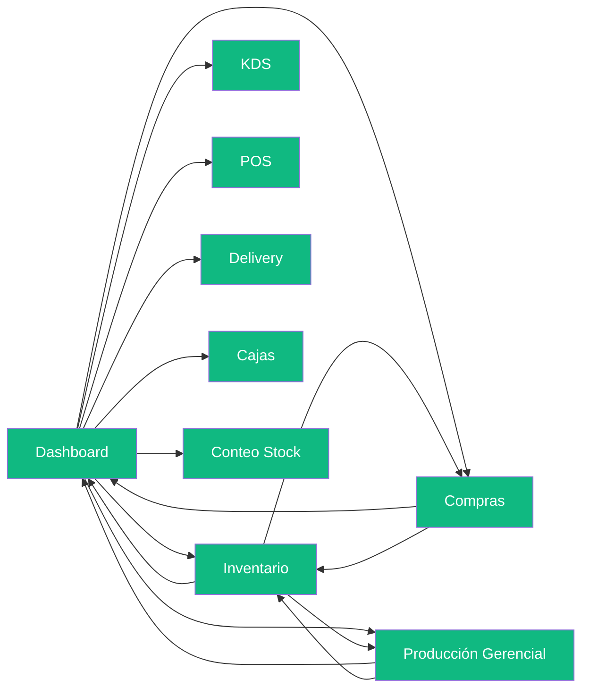

# 🔍 Auditoría de Cobertura: Prototipos vs. Fuente de Verdad

> **Fecha:** 05/08/2026  
> **Fuentes cruzadas:** `anexo_funcional_contrato.md` (18 módulos), `fuente_de_verdad_completa.md` (5 partes), `roadmap_auditoria.md`, y los 17 archivos HTML en `HTML_Prototipos/`.

---

## 1. Matriz de Cobertura por Módulo del Anexo Funcional

| # | Módulo (Anexo) | Prototipo HTML | Estado | Conectado al Sidebar |
|---|----------------|----------------|--------|---------------------|
| 5.1 | **Dashboard Ejecutivo** | [dashboard_prototipo.html](file:///D:/Musica%20Descargada/Burger_Music_OS/HTML_Prototipos/dashboard_prototipo.html) | ✅ Completo | ✅ Sí (Hub central) |
| 5.2 | **Compras y Proveedores** | [compras_inbox_prototipo.html](file:///D:/Musica%20Descargada/Burger_Music_OS/HTML_Prototipos/compras_inbox_prototipo.html) + 5 sub-flujos | ✅ Completo | ✅ Sí |
| 5.3 | **Facturación Inteligente (IA)** | [compras_validacion_prototipo.html](file:///D:/Musica%20Descargada/Burger_Music_OS/HTML_Prototipos/compras_validacion_prototipo.html) + [compras_subir_pdf_prototipo.html](file:///D:/Musica%20Descargada/Burger_Music_OS/HTML_Prototipos/compras_subir_pdf_prototipo.html) | ✅ Completo | ⚠️ Accesible desde Compras |
| 5.4 | **Producción** | [produccion_prototipo.html](file:///D:/Musica%20Descargada/Burger_Music_OS/HTML_Prototipos/produccion_prototipo.html) (Operario) + [produccion_gerencial_prototipo.html](file:///D:/Musica%20Descargada/Burger_Music_OS/HTML_Prototipos/produccion_gerencial_prototipo.html) (Gerente) | ✅ Completo (Dual) | ✅ Sí |
| 5.5 | **Control de Stock** | [inventario_prototipo.html](file:///D:/Musica%20Descargada/Burger_Music_OS/HTML_Prototipos/inventario_prototipo.html) + [conteo_stock_prototipo.html](file:///D:/Musica%20Descargada/Burger_Music_OS/HTML_Prototipos/conteo_stock_prototipo.html) | ✅ Completo | ✅ Sí |
| 5.6 | **Packaging** | — | ❌ Sin prototipo | ❌ No |
| 5.7 | **Punto de Venta (POS)** | [pos_prototipo.html](file:///D:/Musica%20Descargada/Burger_Music_OS/HTML_Prototipos/pos_prototipo.html) | ✅ Completo | ✅ Sí |
| 5.8 | **Cocina (KDS)** | [kds_prototipo.html](file:///D:/Musica%20Descargada/Burger_Music_OS/HTML_Prototipos/kds_prototipo.html) | ✅ Completo | ✅ Sí |
| 5.9 | **Delivery Inteligente** | [delivery_prototipo.html](file:///D:/Musica%20Descargada/Burger_Music_OS/HTML_Prototipos/delivery_prototipo.html) | ✅ Completo | ✅ Sí |
| 5.10 | **Experiencia del Cliente** | — | ❌ Sin prototipo | ❌ No |
| 5.11 | **Comunicación (WhatsApp)** | — | ❌ Sin prototipo | ❌ No |
| 5.12 | **Recursos Humanos** | Parcial (Fichaje en POS) | ⚠️ Parcial | ❌ No tiene pantalla propia |
| 5.13 | **Finanzas** | [finanzas_dashboard_prototipo.html](file:///D:/Musica%20Descargada/Burger_Music_OS/HTML_Prototipos/finanzas_dashboard_prototipo.html) + Movimientos | ✅ Completo | ✅ Sí |
| 5.14 | **Gestión de Cajas** | [cajas_prototipo.html](file:///D:/Musica%20Descargada/Burger_Music_OS/HTML_Prototipos/cajas_prototipo.html) + Gastos Fijos/Eventuales | ✅ Completo | ✅ Sí |
| 5.15 | **Manuales y Procesos** | — | ❌ Sin prototipo | ❌ No |
| 5.16 | **Mantenimiento** | — | ❌ Sin prototipo | ❌ No |
| 5.17 | **Business Intelligence (Ventas)** | [ventas_dashboard_prototipo.html](file:///D:/Musica%20Descargada/Burger_Music_OS/HTML_Prototipos/ventas_dashboard_prototipo.html) + Cierre Z + Sync | ✅ Completo | ✅ Sí |
| 5.18 | **Motor de Automatizaciones** | — | ❌ Sin prototipo | ❌ No |

### Resumen Ejecutivo
| Estado | Módulos | Porcentaje |
|--------|---------|-----------|
| ✅ Completo | 12 de 18 | **67%** |
| ⚠️ Parcial | 1 de 18 | **5%** |
| ❌ Sin prototipo | 5 de 18 | **28%** |

---

## 2. Flujo de Navegación (Conectividad del Sidebar)

> [!NOTE]
> **Los 9 prototipos con sidebar comparten la misma estructura de navegación.** Podés saltar entre Dashboard, Inventario, Compras, Producción Gerencial, KDS, POS, Delivery, Cajas y Conteo sin fricciones. El flujo es circular y consistente.

---

## 3. Cobertura de la Fuente de Verdad (Datos Reales)

| Parte de la Fuente de Verdad | ¿Reflejada en prototipos? | Detalle |
|-------------------------------|--------------------------|---------|
| **Parte 1: Catálogo (Carta)** | ✅ Sí | El POS muestra los productos reales de Pedix (AC/DC, CLASSIC, DUKO, etc.) con precios reales. |
| **Parte 2: Materias Primas** | ✅ Sí | El Inventario muestra las categorías reales (Carnes, Panes, Quesos, Congelados, Verduras) con los ítems reales (Medallones, Bondiola, Pan TBP, etc.). |
| **Parte 3: Recetas (BOM)** | ✅ Sí | La vista de Recetas en Inventario muestra el BOM de AC/DC con barras proporcionales, y las recetas incompletas (CHARLY, GORILLAZ) están marcadas con Trigger 1. |
| **Parte 4: Datos Históricos** | ⚠️ Parcial | El timeline de movimientos de stock usa datos simulados coherentes con los de WhatsApp, pero no hay una vista de "análisis histórico" dedicada. |
| **Parte 5: Preguntas Abiertas** | ✅ Documentado | Los triggers inline reflejan los campos sin completar (ej. "Sin Proveedor", "¿kg o pzas?") y el roadmap documenta las 12 preguntas abiertas para Burger Music. |

---

## 4. Workflows Demostrables de Punta a Punta

### ✅ Flujos que se pueden demostrar fluidamente HOY:

| # | Workflow | Prototipos involucrados | Demo fluida |
|---|----------|------------------------|-------------|
| 1 | **Venta completa** (POS → KDS → Despacho) | `pos` → `kds` | ✅ |
| 2 | **Conteo de stock por turno** | `conteo_stock` | ✅ |
| 3 | **Ver inventario, recetas y alertas** | `inventario` (tabs, acordeones, triggers) | ✅ |
| 4 | **Historial de movimientos de stock** | `inventario` (vista Timeline) | ✅ |
| 5 | **Producción de lotes (Operario)** | `produccion` (mobile) | ✅ |
| 6 | **Auditoría de rinde (Gerente)** | `produccion_gerencial` | ✅ |
| 7 | **Recepción de factura por IA** | `compras_inbox` → `compras_validacion` | ✅ |
| 8 | **Carga manual de compra** | `compras_carga_manual` | ✅ |
| 9 | **Subir PDF de factura** | `compras_subir_pdf` | ✅ |
| 10 | **Arqueo y cierre de caja** | `cajas` → `caja_gastos_eventuales` | ✅ |
| 11 | **Rendición de cadetes** | `cajas` (pestaña Delivery) | ✅ |
| 12 | **Dashboard gerencial completo** | `dashboard` (KPIs, alertas, canales) | ✅ |
| 13 | **Delivery (asignación y seguimiento)** | `delivery` | ✅ |
| 14 | **Auditoría Cierre Z** | `ventas_cierre_z` (3-Way Match) | ✅ |
| 15 | **Corrección 1-Clic de Delivery** | `ventas_sincronizacion` | ✅ |

### ⚠️ Flujos que tienen BRECHAS para una demo fluida:

| # | Brecha | Impacto | Sugerencia |
|---|--------|---------|------------|
| 1 | **Dashboard → Inventario (link profundo):** Las alertas del Dashboard (ej. "Stock bajo") no enlazan directamente al artículo en Inventario. | El usuario ve la alerta pero tiene que buscar el ítem manualmente. | Agregar `href` en las alertas del Dashboard que lleven a `inventario_prototipo.html#cat-carnes`. |
| 2 | **POS → Stock (descuento invisible):** Al "cobrar" en el POS, no hay feedback visual de que el stock se descontó. | El demo no puede mostrar la cascada BOM → Stock en acción. | Agregar un toast/notificación sutil post-cobro: "Stock actualizado: -1 Medallón, -1 Pan TBP". |
| 3 | **Compras → Inventario (ingreso):** Al validar una factura en Compras, no se refleja visualmente el ingreso en Inventario. | No se cierra el ciclo de abastecimiento visualmente. | Agregar un badge "Recién ingresado" en el timeline de movimientos del inventario. |
| 4 | **Producción → Stock (consumo):** Al cerrar un lote en Producción, no se muestra el consumo de materia prima. | El gerente no ve el impacto en el inventario. | Agregar widget "Consumo de MP" en produccion_gerencial. |

---

## 5. Módulos Faltantes (Fase 3/4 — No Urgentes)

Estos módulos están planificados para fases posteriores y **no bloquean la demo actual**:

| Módulo | Prioridad | Justificación |
|--------|-----------|---------------|
| **5.6 Packaging** | Baja | Se puede integrar como sub-categoría de Inventario. |
| **5.10 Experiencia del Cliente** (App, CRM) | Fase 4 | Requiere backend real. |
| **5.11 Comunicación** (WhatsApp) | Fase 4 | Requiere integración API. |
| **5.15 Manuales** | Baja | Repositorio documental, bajo valor de demo. |
| **5.16 Mantenimiento** | Baja | Módulo secundario, sin datos operativos aún. |
| **5.18 Motor de Automatizaciones** | Fase 4 | Requiere lógica de backend. |

---

## 6. Documentación del Proyecto — Estado Actual

| Artefacto MD | Estado | Última Actualización |
|--------------|--------|---------------------|
| [roadmap_auditoria.md](file:///D:/Musica%20Descargada/Burger_Music_OS/MD_Artefactos/roadmap_auditoria.md) | ✅ Al día | Fase 2 UX cerrada, Onboarding completado |
| [fuente_de_verdad_completa.md](file:///D:/Musica%20Descargada/Burger_Music_OS/MD_Artefactos/fuente_de_verdad_completa.md) | ⚠️ Pendiente de Burger Music | Tiene ~120 campos ⬜ COMPLETAR + 12 preguntas abiertas |
| [estrategia_diseno.md](file:///D:/Musica%20Descargada/Burger_Music_OS/MD_Artefactos/estrategia_diseno.md) | ✅ Al día | Incluye Tangibilidad, Pulso, Onboarding, Dual Rol |
| [anexo_funcional_contrato.md](file:///D:/Musica%20Descargada/Burger_Music_OS/MD_Artefactos/anexo_funcional_contrato.md) | ✅ Estable | Documento contractual base (no se modifica) |
| [preguntas_clave_fases.md](file:///D:/Musica%20Descargada/Burger_Music_OS/MD_Artefactos/preguntas_clave_fases.md) | ⚠️ Desactualizado | Las preguntas de Fase 1 ya fueron respondidas pero el doc no lo refleja |
| [walkthrough.md](file:///D:/Musica%20Descargada/Burger_Music_OS/MD_Artefactos/walkthrough.md) | ⚠️ Incompleto | No documenta Inventario, Compras ni Onboarding |
| [walkthrough_fase1_edge_cases.md](file:///D:/Musica%20Descargada/Burger_Music_OS/MD_Artefactos/walkthrough_fase1_edge_cases.md) | ✅ Al día | Edge cases de POS, KDS y Cajas documentados |
| [implementation_plan.md](file:///D:/Musica%20Descargada/Burger_Music_OS/MD_Artefactos/implementation_plan.md) | ✅ Estable | Conceptos A/B/C cerrados y ejecutados |
| [analisis_stock_operativo.md](file:///D:/Musica%20Descargada/Burger_Music_OS/MD_Artefactos/analisis_stock_operativo.md) | ✅ Al día | Las 193 líneas de WhatsApp procesadas |
| [catalogo_music_burger.md](file:///D:/Musica%20Descargada/Burger_Music_OS/MD_Artefactos/catalogo_music_burger.md) | ✅ Al día | Refleja carta activa de Pedix |

---

## 7. Plan de Acción Sugerido (Cerrar Brechas)

> [!IMPORTANT]
> **Para que la demo sea 100% fluida y el circuito se cierre visualmente de punta a punta, las 4 brechas de la Sección 4 son las más urgentes.** Requieren cambios menores (links, toasts, badges) pero tienen un impacto enorme en la percepción de integración del sistema.

### Prioridad Inmediata:
1. **Actualizar `preguntas_clave_fases.md`** — Marcar las preguntas ya respondidas como cerradas
2. **Actualizar `walkthrough.md`** — Consolidar los flujos de Inventario, Compras y Onboarding Inline
3. **Cerrar las 4 brechas de conectividad** — Links profundos Dashboard→Inventario, toast post-cobro POS, badge de ingreso en timeline, widget de consumo en Producción

### Prioridad Media (Siguiente sprint):
4. Prototipar **RRHH** como pantalla propia (fichaje, legajos, asistencia)
5. Prototipar **Finanzas** como pantalla propia (flujo de fondos, ctas por cobrar/pagar)
