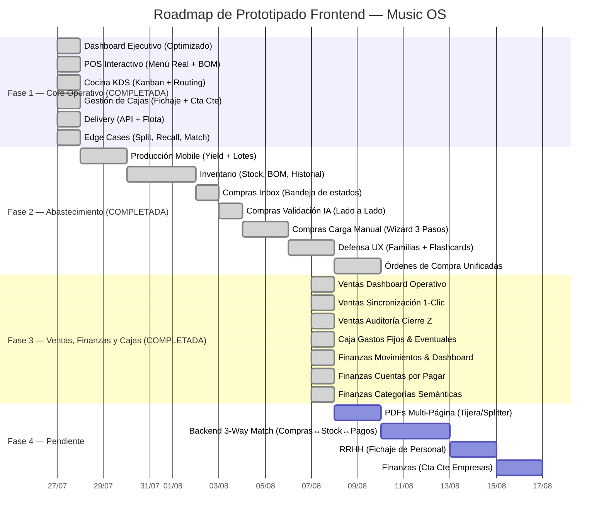

# 🗺️ Roadmap y Auditoría Funcional — Music OS
## Fuente Única de la Verdad del Proyecto

> **Propósito:** Documento maestro consolidado que cruza el **Anexo Funcional (ANEXO_FUNCIONAL_MUSIC_OS.docx)**, el relevamiento de **Catálogo Real (Pedix)**, el **Análisis Operativo (WhatsApp/BOM)**, las **Definiciones Directas de Gerencia (Gaby)** y **todo el trabajo de prototipado y diseño UX** realizado hasta la fecha.
>
> **Última actualización:** 06/08/2026

> [!IMPORTANT]
> Este documento es la **única referencia autorizada** del estado del proyecto. Cualquier decisión de diseño, estrategia UX o resolución funcional que no esté aquí, no existe oficialmente.

---

## 1. Arquitectura de Datos Central
*Principio rector 4.1 y 4.3 del Anexo Funcional: Un único sistema integrado, sin duplicidad de datos.*

**Decisión Estratégica de Gerencia:** "No puede haber diferencias de nombres entre el stock, producción, compras y el resto de los módulos. Vamos a trabajar sobre un catálogo único de artículos."

### 1.1 El Catálogo Unificado (Mapeo Real)
Music OS se construye utilizando los nombres reales de los productos que el personal maneja diariamente (Temática Musical).
* **Categorías Principales (11):** Burgers, Para acompañar, Sanguches, Music Pizza, Promos, Picadas Beat, Ensaladas, Postres, Tostados, Cervezas Goyeneche, Bebidas.
* **Modificadores Transversales:** Tamaño (Simple/Doble/Triple), Papas (Tradicional/Cheddar/Queen), Extras (Nuggets/Aros).
* **Fuente de extracción:** [pedix.app/music-burger](https://pedix.app/music-burger) · Dirección: José Ignacio Rucci 1992, Valentín Alsina.

### 1.2 La Cascada de Materiales (BOM)
Music OS vincula de forma invisible el Catálogo (POS) con el Stock mediante la "Lista de Materiales" extraída de `Productos_BOM_completado_con_detalle.xlsx`.
* **Ejemplo Práctico:** Al vender una *Mala Fama Triple*, el módulo POS alerta automáticamente al módulo de Stock para descontar: 3 medallones, 1 pan, panceta, huevo, cebolla y 3 porciones de cheddar.
* Esto habilita el cálculo real de consumo sin que el operario intervenga.

### 1.3 Documento de Referencia: Fuente de Verdad Completa
Toda la data operativa (catálogo con precios, recetas BOM, insumos base y sus unidades) está consolidada en un documento maestro de **648 líneas**:
📄 [fuente_de_verdad_completa.md](file:///C:/Users/nahue/.gemini/antigravity/brain/6b80ff63-c4f2-470b-a96e-3ceabad9effc/fuente_de_verdad_completa.md)

> [!NOTE]
> Los campos marcados con ⬜ **COMPLETAR** en ese documento son datos que solo el equipo de Burger Music puede confirmar (costos unitarios de insumos). Hasta que estén completos, el sistema no podrá calcular márgenes reales.

---

## 2. Sistema de Diseño (Design System)
*Principio rector 4.6 del Anexo Funcional: Simplicidad Operativa.*

### 2.1 Filosofía UX
**Mandato de Gerencia:** *"La velocidad absoluta sin precisión es un pasivo. El objetivo es Velocidad Precisa."*

Todas las interfaces se diseñan bajo estos principios:
* **Cero carga cognitiva:** Palabras simples, sin jerga técnica. El usuario nunca debería necesitar un manual.
* **Pedagogía visual progresiva:** El sistema enseña mientras se usa (tooltips educativos, badges de color, feedback inmediato).
* **Defensa en profundidad:** Frontend (UX) + Backend (transacciones atómicas). Doble capa de validación.
* **F-Pattern de lectura:** La información más crítica siempre arriba-izquierda.

### 2.2 Especificaciones Técnicas

| Elemento | Especificación |
|---|---|
| **Tipografía Títulos** | Montserrat (SemiBold 600, Bold 700) |
| **Tipografía Cuerpo** | Lato (Regular 400, Medium 500) |
| **Fondo principal** | Gris ultra claro `#F8F9FA` (anti-fatiga visual) |
| **Superficies/Tarjetas** | Blanco `#FFFFFF` con sombras sutiles |
| **Color de Marca** | Naranja refinado `#EA580C` / `#F97316` |
| **Alertas Alta** | Rojo suave `#DC2626` con fondo rojizo claro |
| **Alertas Media** | Ámbar `#D97706` con fondo amarillo claro |
| **Éxito/Validación** | Verde `#10B981` con fondo verde claro |
| **Info/Educativo** | Azul `#2563EB` con fondo azul claro |
| **Sombra Reposo** | `0 4px 6px -1px rgba(0,0,0,0.05)` |
| **Sombra Hover** | Elevación +2px con sombra más profunda |
| **Transiciones** | 200ms–300ms ease para todos los estados |
| **Teclado Mobile** | Forzado a `numeric`/`decimal` en inputs numéricos |

📄 Detalle completo: [estrategia_diseno.md](file:///C:/Users/nahue/.gemini/antigravity/brain/6b80ff63-c4f2-470b-a96e-3ceabad9effc/estrategia_diseno.md)

---

## 3. Módulos Completados: Fase 1 — Core Operativo

### 3.1 Dashboard Ejecutivo (Torre de Control)
📄 Prototipo: [dashboard_prototipo.html](file:///D:/Musica%20Descargada/Burger_Music_OS/HTML_Prototipos/dashboard_prototipo.html)

**Optimizaciones UX realizadas:**
* Rediseño completo con palabras simples y jerarquía visual clara (F-Pattern).
* Grilla financiera consolidada (Ventas Hoy, Egresos, Margen, Ticket Promedio).
* **Alertas Inteligentes unificadas:** Sistema de prioridad (Alta 🔴 / Media 🟡) con accionables directos.
* **Yield Card (Auditoría de Rinde):** Medidor lineal de eficiencia de producción con desglose de merma.
* **Panel Slide-over de Lotes Desviados:** Al hacer clic en "Ver Lotes Desviados", se despliega panel lateral con lotes que excedieron el 3% de merma.

### 3.2 POS Interactivo (Punto de Venta)
📄 Prototipo: [pos_prototipo.html](file:///D:/Musica%20Descargada/Burger_Music_OS/HTML_Prototipos/pos_prototipo.html)

**Funcionalidades implementadas:**
* Catálogo real integrado (11 categorías musicales de Pedix).
* **Modificadores estrictos:** Eliminación total de texto libre. Solo botones de exclusión y agregados.
* **Pagos Avanzados y Edge Cases (100% operativos):** Paneles dinámicos para **Cuenta Corriente** (Validación de límite de crédito por empresa), **Split Payment** (Efectivo + MercadoPago), **Consumo Personal** (Modal de selección de empleado con cálculo de descuento automático) y **Acciones Especiales** (Cortesías por Queja 100% y Demora 10% inyectadas como ítems negativos trazables en la comanda).
* Descuento BOM automático al confirmar venta.

### 3.3 Cocina KDS (Kitchen Display System)
📄 Prototipo: [kds_prototipo.html](file:///D:/Musica%20Descargada/Burger_Music_OS/HTML_Prototipos/kds_prototipo.html)

**Funcionalidades implementadas:**
* **KDS Routing:** Ruteo automático de pedidos según estación (Parrilla vs Mostrador) para evitar embudos.
* **Checklist Atómico:** Cada ingrediente de la comanda se marca individualmente.
* **Recall 10s:** Botón de "deshacer" durante 10 segundos tras completar una comanda, para errores de toque.
* Vista Kanban (columnas por estado: Nuevo → En Preparación → Listo).

### 3.4 Gestión de Cajas
📄 Prototipo: [cajas_prototipo.html](file:///D:/Musica%20Descargada/Burger_Music_OS/HTML_Prototipos/cajas_prototipo.html)

**Funcionalidades implementadas:**
* **Fichaje obligatorio:** PIN/QR para acceder al sistema (responde Preguntas #1 y #2).
* Apertura/cierre de caja con fondo inicial.
* Cuenta corriente para gastos internos.

### 3.5 Delivery
📄 Prototipo: [delivery_prototipo.html](file:///D:/Musica%20Descargada/Burger_Music_OS/HTML_Prototipos/delivery_prototipo.html)

**Funcionalidades implementadas:**
* **Integración API de apps** (PedidosYa, Rappi, MercadoLibre) — responde Preguntas #4 y #5.
* Asignación de flota (delivery propio vs tercerizado).
* Tracking de estados por pedido.

---

## 4. Módulos Completados: Fase 2 — Abastecimiento

### 4.1 Producción (Mobile-First)
📄 Prototipo: [produccion_prototipo.html](file:///D:/Musica%20Descargada/Burger_Music_OS/HTML_Prototipos/produccion_prototipo.html)

**Definiciones de Gerencia:**
* **Físico:** Único local operativo en Lanús (producción + depósito).
* **Lotes:** Hoy NO existen. Music OS los introduce por primera vez.
* **Hardware:** Impresora de etiquetas para identificar lotes producidos.
* **Interfaz:** Optimizada para **celular** (responde Pregunta #10).

**Funcionalidades implementadas:**
* **Separación Semántica de Mermas:**
  * Descarte Real (Rojo): Merma pura, grasa no utilizable.
  * Reaprovechamiento (Ámbar): Recortes para sub-productos (ej. masa de empanadas).
* **Smart Defaults para Mermas de Envase:** El sistema inyecta un Rinde Técnico Esperado del 95% para productos viscosos.
* **Lote Rápido:** Botón que imprime remanente del lote anterior y limpia el formulario instantáneamente.
* Yield (rendimiento) medido automáticamente por lote.

### 4.2 Inventario Unificado (Stock, Recetas y Auditoría)
📄 Prototipo: [inventario_prototipo.html](file:///D:/Musica%20Descargada/Burger_Music_OS/HTML_Prototipos/inventario_prototipo.html)

**Situación Anterior (Pain Points):**
* Control vía grupo de WhatsApp ("📌 STOCK COCINA").
* Mezcla de unidades, sin historial analizable ni alertas automáticas.
* Recetario desconectado del depósito.

**Funcionalidades implementadas:**
* **Estructura de 3 Pestañas:** Stock Operativo, Vista de Recetas (BOM) e Historial de Movimientos.
* **Pestaña Stock (Conteo Rápido):** Listado de insumos organizados por categoría (Carnes, Panes, etc.) con sus unidades estandarizadas (Gramos, Unidades, Litros) y control de Mermas/Alertas.
* **Creación Universal de Ítems (2-en-1):** Flujo unificado con Modal Dinámico para dar de alta Insumos (Stock), Productos (Venta) o Categorías, usando una única interfaz simplificada.
* **Pestaña Recetas (BOM):** Catálogo de Pedix 100% inyectado (Burgers, Sanguches, Pizzas, etc.). Diseño de navegación por sub-acordeones colapsables para velocidad extrema.
* **Workflow "Nueva Receta":** Panel lateral interactivo con buscador dinámico para agregar materias primas a una nueva fórmula de venta.
* **Pestaña Historial (Audit Trail):** Registro inmutable de quién tocó el stock, a qué hora y el comprobante asociado (Venta POS, Recepción de Compras, Ajuste Manual).

📄 Análisis operativo crudo: [analisis_stock_operativo.md](file:///C:/Users/nahue/.gemini/antigravity/brain/6b80ff63-c4f2-470b-a96e-3ceabad9effc/analisis_stock_operativo.md) (las famosas "193 líneas" de WhatsApp procesadas).

### 4.3 Compras — Bandeja de Entrada (Inbox)
📄 Prototipo: [compras_inbox_prototipo.html](file:///D:/Musica%20Descargada/Burger_Music_OS/HTML_Prototipos/compras_inbox_prototipo.html)

**Funcionalidades implementadas:**
* Lista de facturas/remitos con estados visuales: **Pendiente** (amarillo), **Validado** (verde), **Rechazado** (rojo).
* Filtros por proveedor, fecha y estado.
* Acceso directo a "Cargar factura nueva" (flujo manual) o "Ver validación IA" (flujo automático).
* Diseño tipo "email inbox" para familiaridad inmediata del usuario.

### 4.4 Compras — Validación IA (Lado a Lado)
📄 Prototipos: [compras_layout_prototipo.html](file:///D:/Musica%20Descargada/Burger_Music_OS/HTML_Prototipos/compras_layout_prototipo.html) · [compras_subir_pdf_prototipo.html](file:///D:/Musica%20Descargada/Burger_Music_OS/HTML_Prototipos/compras_subir_pdf_prototipo.html) · [compras_validacion_prototipo.html](file:///D:/Musica%20Descargada/Burger_Music_OS/HTML_Prototipos/compras_validacion_prototipo.html)

**Flujo definido por Gerencia:**
1. Proveedores envían facturas/remitos a una casilla de correo (o el usuario sube foto/PDF).
2. **Contexto Previo:** El usuario selecciona el Proveedor (o crea uno nuevo on-the-fly) y la Fecha antes de subir, para darle contexto exacto a la IA.
3. La IA procesa el documento automáticamente.
4. El documento cae en el **Inbox de Validaciones**.
5. La encargada (Mariana) revisa **"lado a lado"** (Imagen escaneada vs. Datos Extraídos por IA) y confirma.
6. Recién ahí entra la mercadería al stock.

*(Responde Preguntas #8 y #9.)*

### 4.5 Compras — Excepciones de Facturación (Proveedores Informales)
* **El Problema:** La Verdulería y el proveedor de Aceite no entregan factura formal en algunos casos.
* **La Solución (Unificación de Flujo):** Se integra la carga de "Comprobante Interno / Remito" directamente en el mismo lienzo de Carga Manual (`?tipo=informal`).
* **Beneficio UX:** Los proveedores informales ahora se benefician de las mismas protecciones (Constructor de Presentaciones Mad-Libs y Anti-Dedo Pesado) sin obligar al usuario a ingresar montos cruzados irreales.

### 4.6 Compras — Carga Manual Defensiva (Wizard de 3 Pasos)
📄 Prototipo: [compras_carga_manual_prototipo.html](file:///D:/Musica%20Descargada/Burger_Music_OS/HTML_Prototipos/compras_carga_manual_prototipo.html)

**El Problema Central:** La carga de facturas es el nodo crítico de captura de valor. Si ingresa basura (unidades incorrectas, errores de tipeo, confusiones de envase), se corrompe el stock y colapsa la conciliación financiera (*3-Way Match*: Compras ↔ Stock ↔ Pagos).

#### Estructura del Wizard:

| Paso | Nombre | Qué hace el usuario |
|------|--------|---------------------|
| **1** | ¿De quién viene? | Elige proveedor, fecha del comprobante y escribe el total exacto del papel |
| **2** | Cargá los productos | Agrega líneas una por una: Cantidad → Producto → Presentación → Precio |
| **3** | ¿Los números cierran? | El sistema suma todo y compara automáticamente contra el total del papel |

#### Capas de Defensa en Profundidad (UX):

**Capa 1 — Familias de Medida (Pedagogía Visual):**
Los productos se clasifican en 3 familias incompatibles entre sí:

| Familia | Badge | Unidades | Ejemplo presentación |
|---|---|---|---|
| **Peso** | 🔵 Azul ⚖️ | Kilogramo, Gramo | "Caja de 5 Kg" |
| **Volumen** | 🟢 Verde 💧 | Litro, Mililitro | "Bidón de 5 Litros" |
| **Conteo** | ⚪ Gris #️⃣ | Unidad | "Pack x 12 Unidades" |

> [!IMPORTANT]
> **Decisión de diseño (04/08/2026):** La columna "Presentación" va **antes** que la unidad de medida en la grilla. El cerebro primero agarra el envase ("Caja") y luego evalúa qué hay adentro ("5 Kg").

**Capa 2 — Columna "Equivale a (Stock)" (Cálculo Automático):**
* El usuario NO hace matemática. Solo dice "2 Cajas".
* El sistema traduce instantáneamente: **"10 Kg"** (porque sabe que 1 Caja = 5 Kg).
* Esto es lo que realmente impactará en el inventario. El usuario recibe feedback visual inmediato (badge azul con el número calculado).

**Capa 3 — Constructor Visual "Flashcards" (Modal Mad-Libs):**
Cuando el usuario necesita crear una nueva presentación que no existe en el sistema, se abre un modal tipo **oración de lectura natural** en 2 pasos:

* **Paso 1:** *"El proveedor me mandó `[ 1 ]` `[ Caja 📦 ]` de **Bondiola**."*
* **Paso 2 (se desbloquea al completar el 1):** *"Y ese envase trae adentro `[ 5 ]` `[ Kilos ]`."*
* **Resultado instantáneo (cartel verde):** *"¡Listo! Cada vez que elijas 'Caja' de Bondiola, el sistema ingresará automáticamente 5.000 gramos a tu stock."*

Esto elimina por completo la necesidad de que el usuario entienda "factores de conversión" o se confunda con etiquetas técnicas.

**Capa 4 — Alerta de "Dedo Pesado" (Validación Cuantitativa):**
* Si el promedio histórico de compra de Tomate es ~50 unidades y el usuario tipea 500, aparece una advertencia amarilla 🟡: *"¿Seguro que son 500? Normalmente comprás alrededor de 50..."*
* No bloquea, solo advierte. El usuario puede confirmar si realmente compró esa cantidad.

**Capa 5 — Bloqueo Matemático Estricto (Control Total):**
* El botón "Aprobar e Ingresar al Stock" permanece **gris e inactivo** hasta que la suma de todas las líneas coincida exactamente con el "Total del Papel" declarado en el Paso 1.
* Diferencia = $0 → Botón se enciende en verde ✅.
* Diferencia ≠ $0 → Cartel rojo con el monto de la diferencia.

---

### 4.7 Compras — Órdenes de Compra (Unificadas)
📄 Prototipos: [compras_ordenes_prototipo.html](file:///D:/Musica%20Descargada/Burger_Music_OS/HTML_Prototipos/compras_ordenes_prototipo.html) · [compras_nueva_orden_prototipo.html](file:///D:/Musica%20Descargada/Burger_Music_OS/HTML_Prototipos/compras_nueva_orden_prototipo.html)

**Funcionalidades implementadas:**
* **Torre de Control:** Listado de órdenes con filtros tipo "Píldora" y diseño de tarjetas con elevación tangible (Híbrido Material Design + Apple HIG).
* **Cero Fricción en Creación:** Grilla modular instantánea al elegir proveedor (sin borradores intermedios).
* **Prevención de Errores (Stock en Búsqueda):** El buscador de artículos avisa el stock actual (ej: "Stock: 2 Cajas") para evitar pedir de más.
* **Metáfora del Documento Físico:** Visualización de detalles de órdenes en bloques blancos puros elevados, simulando una hoja de pedido física.
* **Integración Omnicanal:** Botón FAB para compartir orden directamente por WhatsApp.

---

## 5. Estado de las Preguntas Clave (Auditoría Completa)

### ✅ Preguntas CERRADAS (con prototipo funcional)

| # | Módulo | Pregunta | Resolución | Prototipo |
|---|--------|----------|------------|-----------|
| 1 | Cajas | ¿Fichaje obligatorio? | Sí, PIN/QR para acceder | `cajas_prototipo.html` |
| 2 | Cajas | ¿Apertura/cierre formal? | Sí, con fondo inicial | `cajas_prototipo.html` |
| 4 | Delivery | ¿Integración con apps? | Sí, API de PedidosYa/Rappi/ML | `delivery_prototipo.html` |
| 5 | Delivery | ¿Asignación de flota? | Sí, propio vs tercerizado | `delivery_prototipo.html` |
| 6 | Compras | ¿OC Sugeridas o manuales? | Flujo unificado manual con asistencia de stock en tiempo real | `compras_nueva_orden_prototipo.html` |
| 8 | IA | ¿Auto-aprobación? | No. Revisión visual obligatoria (lado a lado) | `compras_layout_prototipo.html` |
| 9 | IA | ¿Quién revisa? | Mariana/Encargado confirma | `compras_validacion_prototipo.html` |
| 10 | Producción | ¿Formato UI? | Mobile-first (celular) | `produccion_prototipo.html` |
| 11 | Stock | ¿Dónde se cargan mermas? | En la misma pantalla de conteo (Container Transform) | `conteo_stock_prototipo.html` |
| 12 | Stock | ¿Alertas de mínimo? | Sí, configurables por producto individual | `conteo_stock_prototipo.html` |
| 13 | Stock | ¿Quién recibe las alertas? | Dashboard central del responsable | `dashboard_prototipo.html` |
| 14 | Stock | ¿Unidades estandarizadas? | Sí, "Smart Units" normalizadas por el sistema | `conteo_stock_prototipo.html` |

### ✅ Decisiones de Diseño CERRADAS (sin pregunta previa)

| Decisión | Descripción | Prototipo |
|----------|-------------|-----------|
| KDS Routing | Ruteo automático por estación (Parrilla vs Mostrador) | `kds_prototipo.html` |
| Modificadores Estrictos | Eliminación de texto libre, solo botones | `pos_prototipo.html` |
| Consumo de Personal | Cobro bonificado que descuenta BOM sin afectar caja | `pos_prototipo.html` |
| Dashboard Torre de Control | Grilla financiera + Alertas + Yield Card | `dashboard_prototipo.html` |
| Edge Cases UX | Checklist Atómico, Recall 10s, Botón Gamificado, Bottom Sheet | Varios prototipos |
| Familias de Medida | 3 familias incompatibles (Peso/Volumen/Conteo) con badges | `compras_carga_manual_prototipo.html` |
| Constructor Flashcards | Creación de presentaciones tipo oración natural | `compras_carga_manual_prototipo.html` |
| Equivalencias Auto | Columna calculada "Equivale a (Stock)" | `compras_carga_manual_prototipo.html` |
| Dedo Pesado | Alerta si cantidad supera 3x promedio histórico | `compras_carga_manual_prototipo.html` |
| Bloqueo Matemático | Botón de aprobación solo activo si Total coincide | `compras_carga_manual_prototipo.html` |
| Presentación → Medida | Orden de columnas: Presentación primero, Equivalencia después | `compras_carga_manual_prototipo.html` |
| Unificación Flujo Informal | Uso del lienzo manual para cargar remitos sin exigir monto papel (`?tipo=informal`) | `compras_carga_manual_prototipo.html` |
| Proveedor On-the-Fly | Creación de proveedores en modal in-line en cualquier pantalla de carga (Manual/IA) | `compras_carga_manual_prototipo.html` / `compras_subir_pdf_prototipo.html` |
| Contexto IA Upload | Solicitud de Proveedor y Fecha antes de subir el PDF para mejorar precisión IA | `compras_subir_pdf_prototipo.html` |
| Híbrido Material/HIG | Uso de elevación/sombras solo para documentos reales; listas planas tipo Apple HIG | `compras_ordenes_prototipo.html` |
| Prevención de Errores OC | Mostrar stock disponible directamente en el input de búsqueda de productos | `compras_nueva_orden_prototipo.html` |
| Modal Central | Reemplazo de panel lateral por modal central enfocado para detalles de facturas | `compras_inbox_prototipo.html` |
| Vista 360 Proveedor | Layout de cuenta corriente con KPIs, tabla cronológica y modal de pago integrado | `compras_proveedor_cuenta_prototipo.html` |
| Avatar Dinámico UI | Uso de iniciales de usuario y colores semánticos para fácil identificación en barra lateral y tablas | Varios prototipos |
| Categorización Visual | Uso de avatares con iconos y colores para clasificar gastos en lugar de texto plano | `finanzas_categorias_prototipo.html` |

### ⏳ Preguntas pendientes por resolver (Fase 3/4)

| Módulo | Pregunta Crítica para Diseño |
|--------|------------------------------|
| **RRHH (5.12)** | ¿El sistema incluye un reloj fichador (PIN/QR) para el personal? |
| **Finanzas (5.13)** | ¿Habrá facturación de cuenta corriente para empresas/eventos? |
| **Producción (5.4)** | ¿Cómo es el workflow exacto de fabricación de Pan TBP (kilos de masa cruda vs placas vs merma de horneado)? |
| **Producción (5.4)** | ¿Cómo es el workflow de elaboración de Salsas (rendimiento por litro vs descarte)? |
| **Compras (5.3)** | ¿Cómo se maneja el "Splitter" para PDFs de múltiples páginas de un mismo proveedor? |
| **3-Way Match** | ¿Cómo se cruzan las validaciones frontend (Familias de Medida) con la auditoría backend (Compras ↔ Stock ↔ Pagos)? |

---

## 6. Inventario Completo de Prototipos

Todos los prototipos son archivos HTML interactivos funcionales alojados en:
📁 `D:\Musica Descargada\Burger_Music_OS\HTML_Prototipos\`

| # | Archivo | Módulo | Estado |
|---|---------|--------|--------|
| 1 | `dashboard_prototipo.html` | Dashboard Ejecutivo | ✅ Completo |
| 2 | `pos_prototipo.html` | Punto de Venta | ✅ Completo |
| 3 | `kds_prototipo.html` | Cocina KDS | ✅ Completo |
| 4 | `cajas_prototipo.html` | Gestión de Cajas | ✅ Completo |
| 5 | `delivery_prototipo.html` | Delivery | ✅ Completo |
| 6 | `produccion_prototipo.html` | Producción (Mobile) | ✅ Completo |
| 7 | `conteo_stock_prototipo.html` | Control de Stock | ✅ Completo |
| 8 | `compras_inbox_prototipo.html` | Compras — Bandeja | ✅ Completo |
| 9 | `compras_layout_prototipo.html` | Compras — Layout IA | ✅ Completo |
| 10 | `compras_validacion_prototipo.html` | Compras — Validación IA | ✅ Completo |
| 11 | `compras_nueva_factura_prototipo.html` | Compras — Pre-carga | ✅ Completo |
| 12 | `compras_carga_manual_prototipo.html` | Compras — Carga Manual (Wizard) | ✅ Completo |
| 13 | `compras_ordenes_prototipo.html` | Compras — Listado Órdenes | ✅ Completo |
| 14 | `compras_nueva_orden_prototipo.html` | Compras — Nueva Orden Unificada | ✅ Completo |
| 15 | `compras_recepciones_prototipo.html` | Compras — Recepciones | ✅ Completo |
| 16 | `compras_proveedor_cuenta_prototipo.html` | Compras — Cta Cte Proveedor | ✅ Completo |
| 17 | `finanzas_movimientos_prototipo.html` | Finanzas — Libro Movimientos | ✅ Completo |
| 18 | `finanzas_dashboard_prototipo.html` | Finanzas — Dashboard | ✅ Completo |
| 19 | `finanzas_cuentas_pagar_prototipo.html` | Finanzas — Cuentas por Pagar | ✅ Completo |
| 20 | `finanzas_categorias_prototipo.html` | Finanzas — Categorías | ✅ Completo |
| 21 | `ventas_historial_prototipo.html` | Ventas — Historial Tickets | ✅ Completo |
| 22 | `ventas_dashboard_prototipo.html` | Ventas — Dashboard Operativo | ✅ Completo |
| 23 | `ventas_sincronizacion_prototipo.html` | Ventas — Sincronización Apps | ✅ Completo |
| 24 | `ventas_cierre_z_prototipo.html` | Ventas — Auditoría Cierre Z | ✅ Completo |
| 25 | `caja_gastos_fijos_prototipo.html` | Caja — Gastos Fijos | ✅ Completo |
| 26 | `caja_gastos_eventuales_prototipo.html` | Caja — Gastos Eventuales | ✅ Completo |
| 27 | `caja_ingresos_extra_prototipo.html` | Caja — Ingresos Extra | ✅ Completo |

**Total: 27 prototipos funcionales.**

---

## 7. Inventario de Artefactos de Documentación

| Artefacto | Propósito |
|-----------|-----------|
| [roadmap_auditoria.md](file:///C:/Users/nahue/.gemini/antigravity/brain/6b80ff63-c4f2-470b-a96e-3ceabad9effc/roadmap_auditoria.md) | **Este documento.** Fuente única de la verdad. |
| [fuente_de_verdad_completa.md](file:///C:/Users/nahue/.gemini/antigravity/brain/6b80ff63-c4f2-470b-a96e-3ceabad9effc/fuente_de_verdad_completa.md) | Catálogo completo, BOM, insumos base, precios y unidades. |
| [anexo_funcional_contrato.md](file:///C:/Users/nahue/.gemini/antigravity/brain/6b80ff63-c4f2-470b-a96e-3ceabad9effc/anexo_funcional_contrato.md) | Copia del Anexo Funcional contractual (alcance legal). |
| [estrategia_diseno.md](file:///C:/Users/nahue/.gemini/antigravity/brain/6b80ff63-c4f2-470b-a96e-3ceabad9effc/estrategia_diseno.md) | Design System (tipografía, colores, sombras, microinteracciones). |
| [analisis_stock_operativo.md](file:///C:/Users/nahue/.gemini/antigravity/brain/6b80ff63-c4f2-470b-a96e-3ceabad9effc/analisis_stock_operativo.md) | Relevamiento crudo de WhatsApp (las "193 líneas"). |
| [catalogo_music_burger.md](file:///C:/Users/nahue/.gemini/antigravity/brain/6b80ff63-c4f2-470b-a96e-3ceabad9effc/catalogo_music_burger.md) | Extracción original del catálogo Pedix. |
| [preguntas_clave_fases.md](file:///C:/Users/nahue/.gemini/antigravity/brain/6b80ff63-c4f2-470b-a96e-3ceabad9effc/preguntas_clave_fases.md) | Registro original de las preguntas por fase. |
| [implementation_plan.md](file:///C:/Users/nahue/.gemini/antigravity/brain/6b80ff63-c4f2-470b-a96e-3ceabad9effc/implementation_plan.md) | Plan de implementación de Familias de Medida. |

---

## 8. Roadmap de Prototipado (Gantt Actualizado)

---

## 9. Próximos Pasos Técnicos (Acción Inmediata)

| Prioridad | Tarea | Descripción |
|-----------|-------|-------------|
| 🔴 Alta | **Tijera/Splitter para PDFs** | Diseñar la interacción para extraer páginas específicas de PDFs largos de proveedores con múltiples facturas en un solo archivo. |
| 🔴 Alta | **Definición Backend 3-Way Match** | Estructurar cómo las validaciones del frontend (Familias de Medida, Equivalencias) se auditan y cruzan a nivel base de datos entre Compras ↔ Stock ↔ Pagos. |
| 🟡 Media | **Workflow de Salsas y Pan TBP** | Definir con Gerencia los rendimientos exactos de estos productos intermedios para calibrar el módulo de Producción. |
| ⚪ Baja | **RRHH y Finanzas** | Prototipar módulos de Fase 3/4 una vez que el Core Operativo esté en producción. |
