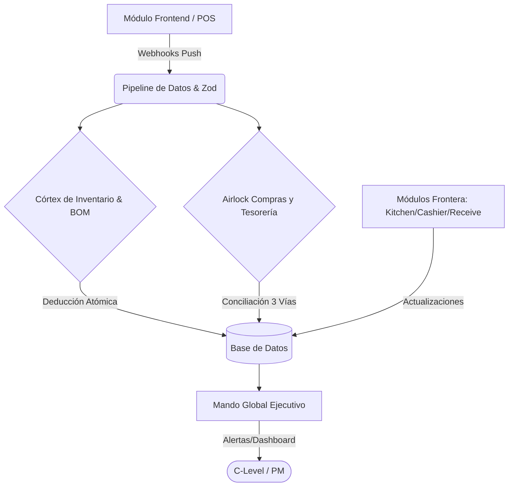

# MASTER AUDIT REPORT & TECHNICAL BLUEPRINT - BURGERMUSIC OS (V3.1)

**Para:** Project Management / C-Level
**Estado:** UAT Ready (Estado Cero Inicializado)
**Fecha de Emisión:** 19 de Marzo de 2026

---

> [!IMPORTANT]
> **Resumen Ejecutivo:** El sistema BurgerMusic OS versión 3.1 ha alcanzado el estado de *UAT Ready* (User Acceptance Testing) y se encuentra inicializado en *Estado Cero*. Este documento sirve como plano técnico y reporte de auditoría del ecosistema unificado.

## Arquitectura de Módulos

### 1. MANDO GLOBAL EJECUTIVO (Command Center)
**Objetivo:** Supervisión de nivel C, predicción de supervivencia financiera y detección de anomalías en tiempo real.

- **Visual y Función:** Interfaz de Cuadrícula Bento (Bento Grid) dividida en 4 zonas tácticas de latencia cero:
  - **Barra de Salud:** Margen Bruto, Sangrado Financiero.
  - **Radar de Fuego:** Alertas de IA sobre robos o quiebres de stock.
  - **Leaderboard:** Rendimiento de sucursales.
  - **Oráculo:** Predicción de Cashflow.

> [!TIP]
> Esta capa otorga visibilidad absoluta sobre las operaciones y las finanzas, habilitando decisiones instantáneas respaldadas por la IA.

---

### 2. CÓRTEX DE INVENTARIO Y MOTOR BOM (Master Data Management)
**Objetivo:** Traducción de ventas en deducciones atómicas de ingredientes y cálculo del Actual vs Teórico (AvT).

- **Visual y Función:** Tableros interactivos (`/inventory`) con simuladores de costos y rentabilidad.
- **Motor BOM (Bill of Materials):** Utiliza "Fuzzy Matching" para deducir matemáticamente los ingredientes exactos (ej. 2 medallones, 4 fetas cheddar) por cada producto vendido.
- **Analítica de Inventario:** Cruza datos históricos para calcular los Días de Stock (DOH) e identificar mermas físicas.

---

### 3. AIRLOCK DE COMPRAS Y TESORERÍA (Procurement & Cashflow)
**Objetivo:** Erradicar el fraude de proveedores mediante "Conciliación a Tres Vías" (Three-Way Match) y gestionar la liquidez.

- **Visual y Función:** Interfaces de aprobación ejecutiva (`/procurement/approvals`).
- **Motor de Tesorería:** Convierte la facturación caótica en un flujo predecible con "Prorrateo de Devengamiento Diario" (Daily Accrual), deduciendo gastos fijos como el alquiler día a día para mostrar un P&L (Profit & Loss) en tiempo real.
- **Control de Flujo:** Cruza rigurosamente Cuentas por Pagar vs Cuentas por Cobrar.

> [!CAUTION]
> El sistema de Conciliación a Tres Vías es el guardián de la integridad financiera. Todo remito debe coincidir con la orden de compra y la factura.

---

### 4. MÓDULOS OPERATIVOS DE FRONTERA (Closed-Loop)
**Objetivo:** Capturar la verdad operativa en la trinchera y obligar a la resolución de fricciones.

**Interfaces Tablet-Friendly de uso diario:**
- **`/receive` (Mercadería):** Ingreso de remitos que promedian el costo unitario en tiempo real.
- **`/kitchen` (Cocina):** Declaración de Mermas (Wastage) y conteos físicos ciegos.
- **`/cashier` (Cierre de Caja):** Validación de discrepancias de efectivo contra las ventas del sistema POS.

---

### 5. INTEGRACIÓN B2B Y PIPELINE DE DATOS
**Objetivo:** Mantener el sistema vivo con datos inmutables y en tiempo real.

- **Webhooks Push:** Recepción de transacciones validadas por Zod desde los locales físicos (ej. `POST /api/webhooks/pos`) asegurando total idempotencia.
- **Pipeline ETL Resiliente:** Aísla filas o transacciones corruptas de la cadena de datos, garantizando que nunca colapse la base de datos principal, manteniendo una alta disponibilidad.

---

