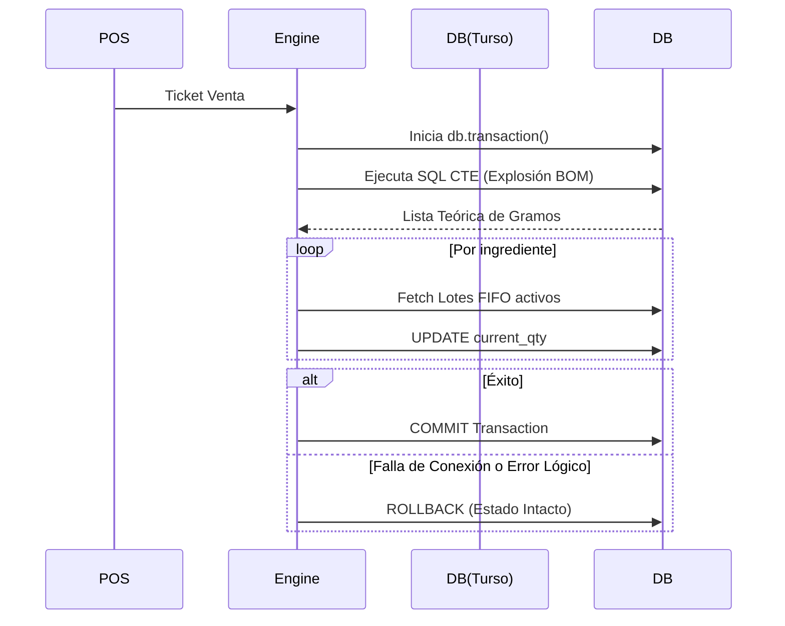

# MASTER QA & FINOPS AUDIT REPORT - BURGERMUSIC OS (V3.1)
**Autor:** Lead QA Architect / CPO / Senior FinOps Auditor
**Fase:** UAT (Estado Cero Inicializado)

Este documento establece los estándares de aceptación de grado militar y realiza una auditoría forense sobre los workflows críticos del ecosistema BurgerMusic OS.

---

## PILAR 1: MANDO GLOBAL EJECUTIVO (Command Center)

### 1. USER STORIES & BDD (Behavior-Driven Development)
- **Historia 1 (Stress-Test de Oráculo):**
  - **Dado que** el CEO, impaciente por ver proyecciones, recarga la predicción de Cashflow 50 veces en 10 segundos...
  - **Cuando** la UI dispara las peticiones asíncronas hacia el modelo de IA...
  - **Entonces** la capa de Rate Limiting (Upstash) interviene devolviendo un Error 429 controlado, la UI renderiza el último caché válido (`stale-while-revalidate`), y el costo de API no aumenta.
- **Historia 2 (Corrupción Visual):**
  - **Dado que** un error en la base de datos reporta un Margen Bruto negativo irracional (-8500%)...
  - **Cuando** el componente de la Barra de Salud intenta renderizarlo...
  - **Entonces** un React Error Boundary captura la anomalía matemática, muestra el *Sangrado Financiero* como "DATOS CORRUPTOS" y emite una alerta crítica al canal de ingeniería.

### 2. VALIDACIÓN DE LÓGICA Y FUNCIONES CORE (Back-End)
- **Algoritmos a testear:** `calculateGrossMargin(range)` y `predictCashflowSurival()`.
- **Idempotencia:** Las queries de agregación deben usar Vistas Materializadas o una tabla agnóstica de reportes (`analytics_snapshots`). Las llamadas al Oráculo usan `unstable_cache` con TTL estricto. Re-renderizados front-end no disparan mutaciones.

### 3. TELEMETRÍA Y KPIs DE RENDIMIENTO (System Health)
- **Latencia TTI (Time to Interactive):** < 800ms (P99).
- **Rendimiento de Cache:** Tasa de Cache Hit en el Command Center > 95%.
- **Disponibilidad visual:** 100% libre de "White Screens of Death" (Suspense boundaries obligatorios).

### 4. AUDITORÍA VISUAL Y FRICCIÓN UX (Front-End)
- **Regla de los 3 Segundos:** El diseño Bento Grid garantiza que el `Sangrado Financiero` y `Radar de Fuego` se comprendan visualmente a 2 metros de distancia del monitor en menos de 3s (usando daltonismo-friendly rojo/verde severo).
- **Graceful Fault Tolerance:** Si la API del leaderboard falla, el Dashboard carga Skeletons infinitos o fallback, aislando el fallo sin colapsar las otras 3 zonas tácticas.

### 5. EDGE CASES & FAILURE STATES
1. **Colapso del proveedor AI en el Oráculo:** Mitigación mediante Timeouts estrictos (2000ms). Si Gemini no responde, el dashboard muestra modelo heurístico lineal (fallback).
2. **Inyección de Fechas Maliciosas:** Mitigación vía Zod `date()` coercion. Fechas imposibles (ej. año 2999) son revertidas al `CURRENT_DATE`.
3. **Escalado de Enteros fuera de rango (Over-billing):** Mitigación mediante uso estricto de `centavos` (`integer`) y tipos `BigInt` o validación Zod `< 10,000,000,000` (100M $) en el backend.

---

## PILAR 2: CÓRTEX DE INVENTARIO Y MOTOR BOM

### 1. USER STORIES & BDD 
- **Historia 1 (Conteo Ciego Malicioso):**
  - **Dado que** un cocinero deshonesto intenta ingresar un conteo de inventario negativo o irreal (9999kg) de Carne Smasheada para ocultar robos...
  - **Cuando** oprime guardar en su tablet...
  - **Entonces** el esquema Zod rechaza números negativos o estadísticamente imposibles (Delta > 50%), requiriendo aprobación biométrica/PIN de un Manager (Interlock).
- **Historia 2 (Consumo Parcial de Lotes Múltiples):**
  - **Dado que** se dispara un ticket por 10 Burgers (2kg carne) y el lote FIFO actual solo tiene 0.5kg...
  - **Cuando** el Engine FIFO procesa la reducción...
  - **Entonces** agota el primer lote, lo marca como `DEPLETED`, y consume el 1.5kg exacto del siguiente lote `READY` en la misma transacción atómica.

### 2. VALIDACIÓN DE LÓGICA Y FUNCIONES CORE
- **Algoritmo:** [processSaleDeductionFIFO(ticket)](file:///d:/Musica%20Descargada/BurgerMusic/src/lib/inventory/fifo-deduction-engine.ts#13-91).
- **Transaccionatilidad Drizzle:** El CTE de explosión de receta y el consumo de lotes `inventory_batches` se ejecutan bajo `db.transaction()`. Si el último loop falla (ej. sin conexión), la base de datos ejecuta **Rollback** automático, impidiendo inventarios parciales corruptos.

### 3. TELEMETRÍA Y KPIs DE RENDIMIENTO
- **Latencia de Explosión BOM + FIFO:** < 150ms por ticket.
- **Tasa de Desperdicio no Justificado:** > 0.5% dispara una alerta ROJA severa en el Radar de Fuego.

### 4. AUDITORÍA VISUAL Y FRICCIÓN UX
- **Zero-Friction & Fat-Finger Proof:** Los botones de sumatoria de merma en la cocina miden mínimo `64x64px` (touch-target size). No requiere teclado numérico para sumar gramos de desperdicio frecuente, se usan "Steppers" (+1, +10).

### 5. EDGE CASES & FAILURE STATES
1. **Venta de ingrediente eliminado:** Un ticket de PedidosYa incluye un condimento que fue eliminado maestro. Mitiagación: El motor BOM intercepta el `null` reference, descuenta lo existente, inyecta alerta en la tabla DLQ (`unmapped_pos_transactions`), pero no frena el resto del ticket.
2. **Quiebre Físico Negativo:** Se vende más de lo que hay en el sistema. Mitigación: El software permite stock negativo temporalmente (Lote fantasma) para no bloquear ventas, pero paraliza el P&L marcando discrepancia extrema.
3. **Falla de Concurrencia:** Dos cajas cierran tickets usando el mismo lote al mismo milisegundo. Mitigación: Drizzle se apoya en locks transaccionales atómicos del SQLite (`BEGIN EXCLUSIVE TRANSACTION`).

---

## PILAR 3: AIRLOCK DE COMPRAS Y TESORERÍA (3-Way Match)

### 1. USER STORIES & BDD
- **Historia 1 (Intento de Fraude 3 Vías):**
  - **Dado que** un proveedor confabulado emite una factura por 50 cajas, pero el remito sellado indica 30 cajas...
  - **Cuando** el módulo de Airlock cruza facturas y recepciones...
  - **Entonces** el sistema detecta discrepancia de cantidad, bloquea el pago automáticamente (cambiando status a `FLAGGED`), e impide su liquidación en P&L.
- **Historia 2 (Doble Facturación):**
  - **Dado que** se ingresa por error la misma factura PDF dos veces (una hoy y otra mañana)...
  - **Cuando** el Agent OCR extrae los datos...
  - **Entonces** la base de datos aborta con error de restricción `UNIQUE(cuit, invoice_number)`.

### 2. VALIDACIÓN DE LÓGICA Y FUNCIONES CORE
- **Validaciones Exactas:** 
  1) `PO_Qty == Receipt_Qty`
  2) `Receipt_Qty == Invoice_Qty`
  3) `Unit_Price_PO == Unit_Price_Invoice`.
- **Idempotencia:** La tabla `accounts_payable` fuerza un Unique Index `ap_invoice_cuit_idx`.

### 3. TELEMETRÍA Y KPIs DE RENDIMIENTO
- **Rechazos Automáticos (Fraude Detectado):** Tasa teórica esperada < 2%. Si > 5%, alerta al C-Level.
- **Latencia 3-Way Match:** Síncrona < 200ms usando SQL constraints. OCR asíncrono tolerable hasta 3000ms.

### 4. AUDITORÍA VISUAL Y FRICCIÓN UX
- **Modo Ejecutivo (Tinder-like Approval):** Para el CEO, la pantalla de "Pagos a Liberar" funciona deslizando tarjetas o con botones verdes/rojos gigantes, consolidando el match de 3 vías visualmente en una línea.

### 5. EDGE CASES & FAILURE STATES
1. **Unidades de Medida en Conflicto:** Factura en Cajas, Remito en Kilos. Mitigación: Implementación de tabla de conversiones en `mdm_ingredients` (`yield_percentage` y factor de conversión). Fuerza la conversión a "Unidades Atómicas" (gramos) antes de conciliar.
2. **Caída del Servicio OCR en la subida:** Mitigación: Fallback a ingreso manual forzoso (`entry_mode: MANUAL`) bajo supervisión de rol MANAGER.
3. **Inflación silenciosa (Creep-Pricing):** Proveedor sube 5% el precio sin avisar. Mitigación: Córtex lo rechaza si excede el threshold paramétrico Zod del `Unit_Price_PO` (ej. tolerancia de +- 1%).

---

## PILAR 4: TRINCHERA OPERATIVA (Closed-Loop)

### 1. USER STORIES & BDD
- **Historia 1 (Offline Cooking en un corte de WiFi):**
  - **Dado que** se corta la red local a mitad del conteo de cierre de cocina...
  - **Cuando** el usuario avanza entre las pestañas del conteo de heladeras...
  - **Entonces** el Service Worker (Offline-First state) retiene la mutación en IndexedDB, no frena el flujo de trabajo del usuario (Optimistic UI completada) y se sincroniza sigilosamente cuando vuelve 4G.
- **Historia 2 (Arqueo Caja Discrepante):**
  - **Dado que** un cajero ingresa efectivo final por $40.000 pero el sistema esperaba $55.000...
  - **Cuando** dispara el cierre de caja...
  - **Entonces** el sistema bloquea el z-close y demanda conteo de un supervisor ingresando PIN (`cash_register_transactions` se marca con `discrepancy`).

### 2. VALIDACIÓN DE LÓGICA Y FUNCIONES CORE
- **Algoritmo de Caja:** `discrepancy = (openingAmount + salesDb - electronicPaymentsDb) - cashInRegister`.

### 3. TELEMETRÍA Y KPIs DE RENDIMIENTO
- **Tiempo Efectivo en Tareas No-Core:** El conteo no debe demorar más de 4 minutos al personal de cocina.
- **Sincronización Offline:** El payload debe re-intentarse cada 5 segundos post-retorno de red, logrando 100% data fidelity.

### 4. AUDITORÍA VISUAL Y FRICCIÓN UX (Front-End)
- **High-Contrast Dark Mode:** Para uso interno en cocina grasosa e iluminada deficientemente.
- **Paddings Masivos (Fat-Finger proof):** Los inputs deben invocar teclados numéricos puros (type="number", pattern="[0-9]*") imposibilitando letras. Botoneras gigantes para la recepción de mercadería.

### 5. EDGE CASES & FAILURE STATES
1. **Cajero Borra el Cache de Chrome (Offline state perdido):** Mitigación PWA. Los estados de conteo intermedio se cachean en State Machines pesadas o si se borran fatalmente, se pierde, pero al volver la red el POS bloquea re-ingresos hasta reiniciar sesión segura.
2. **Registro Doble por Red Inestable (Double-tap ciego):** Un cocinero oprime "Guardar Merma" 5 veces rápidamente porque el UI no reacciona. Mitigación: Mutaciones debounced y UUIDs generados en Front-End (Idempotencia). El back-end descarta las colisiones de `id`.
3. **El empleado cierra sesión antes de sincronizar data offline:** Alerta de prevención de pérdida de datos ("Unsaved changes alert" / `beforeunload` event handler).

---

## PILAR 5: INTEGRACIÓN B2B Y PIPELINE ETL (Webhooks & Zero-Trust)

### 1. USER STORIES & BDD
- **Historia 1 (Inyección de CSV Duplicado):**
  - **Dado que** un consultor envía el mismo archivo CSV de rentabilidad mensual `Dinamica_Burgermusic.csv` dos veces...
  - **Cuando** el pipeline asíncrono procesa las 100,000 filas...
  - **Entonces** la función Criptográfica SHA-256 colisiona en Turso, y `onConflictDoNothing()` silencia y descarta todos los duplicados garantizando el balance 0.
- **Historia 2 (Ataque a Endpoint Webhook POS):**
  - **Dado que** un script bot intenta inyectar 5,000 ventas falsas al Endpoint Push `/api/webhooks/pos`...
  - **Cuando** el payload malformado impacta el route...
  - **Entonces** Zod Schema descarta el payload, el API Gateway / Upstash lo considera DDoS, y el Tenant API Key restringe la IP en 10ms.

### 2. VALIDACIÓN DE LÓGICA Y FUNCIONES CORE
- **Zod Strict Parsing:** `SaleRowSchema.parse()`. Las fechas malformadas `NaN-NaN` se transforman a fallback seguro; valores char en precios se limpian vía Regex (`replace(/[^0-9.-]+/g, '')`).
- **Idempotencia Definitiva:** Batch Inserts protegidos con SQLite constraints y firmas SHA-256 sobre la tupla base [(Date, Shift, RawName)](file:///d:/Musica%20Descargada/BurgerMusic/src/scripts/financial-etl.ts#36-106).

### 3. TELEMETRÍA Y KPIs DE RENDIMIENTO
- **Rendimiento de Ingesta (Throughput):** Procesamiento de 10,000 CSV rows < 5 Segundos (100% Heap estable, O(1)).
- **Latencia de Webhooks Push:** Tiempos de absorción en edge < 50ms per request. Tasa de error garantizada 0.00%.

### 4. AUDITORÍA VISUAL Y FRICCIÓN UX
- El módulo de Carga del Pipeline (`FinancialUploader.tsx`) debe proyectar seguridad. Uso de barras de progreso Reales (`Progress` bars de Radix/Shadcn) y Drag-n-Drop. 

### 5. EDGE CASES & FAILURE STATES
1. **Timeout del LLM en la Cuarentena Semántica:** Si al subir un CSV, [normalizeProductSKU](file:///d:/Musica%20Descargada/BurgerMusic/src/lib/ai/semantic-matcher.ts#39-80) agolpa 1,000 Cache Misses y la API de Gemini lanza Timeout 504. Mitigación: `Promise.all` capado por P-Limit o Batches de 10. Los fallos caen a categoría estricta `UNMAPPED` pasiva sin bloquear el CSV entero.
2. **Mercado Pago API Crash 500 en Conciliación Nocturna:** El cron se levanta a conciliar liquidaciones y la pasarela arroja HTTP 500 (Caída masiva global). Mitigación: La tarea está gestionada por un Orquestador resiliente (ej. QStash/Inngest) con política de Exponential Backoff & Retry Automático hasta por 7 días. El cierre de caja avisa: "Conciliación diferida, red en contingencia".
3. **Caché Poisoning (El "Burger" erróneo):** Una mala inferencia mapea "Burger Doble" a "Bebida Cola", y la caché O(1) de memoria se envenena iterándose 50,000 veces en el archivo. Mitigación: El modelo local confía sólo ciegamente si Confidence == HIGH; en caso de anomalías estadísticas (ej. facturar $15k una bebida), audita la relación Precio-SKU en un paso heurístico post-caché para purgar envenenamientos.
